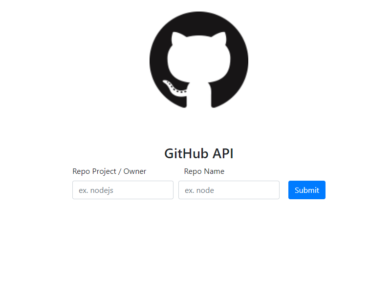
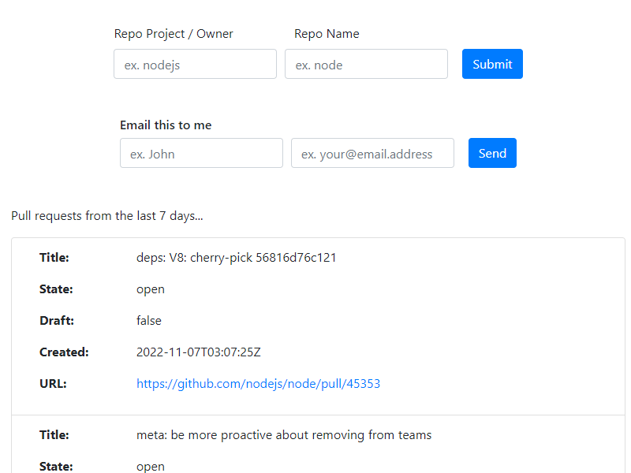

# git-pulls-demo

Simple nodejs express app.  

Allows you to enter a Github project/owner and repo name and will return all pull requests for that repo in the last 7 days.  

You can then enter your name and email address to have the list emailed to you (be sure to check your spam folder)  

A big thanks to the following blogs that helped me figure out how to do this.

started with this...
https://codesnippet.io/github-api-tutorial/

then picked up most of the layout from this... 
https://betterstack.com/community/guides/scaling-nodejs/build-nodejs-application-express-pug/

and email from this...
https://www.simplifiedcode.co.in/blog/how-to-send-email-using-nodemailer-from-nodejs-server

sources
https://github.com/timmywheels/github-api-tutorial  
https://github.com/betterstack-community/hacker-news/blob/master/server.js  
https://github.com/ayushkumar731/nodemailer
